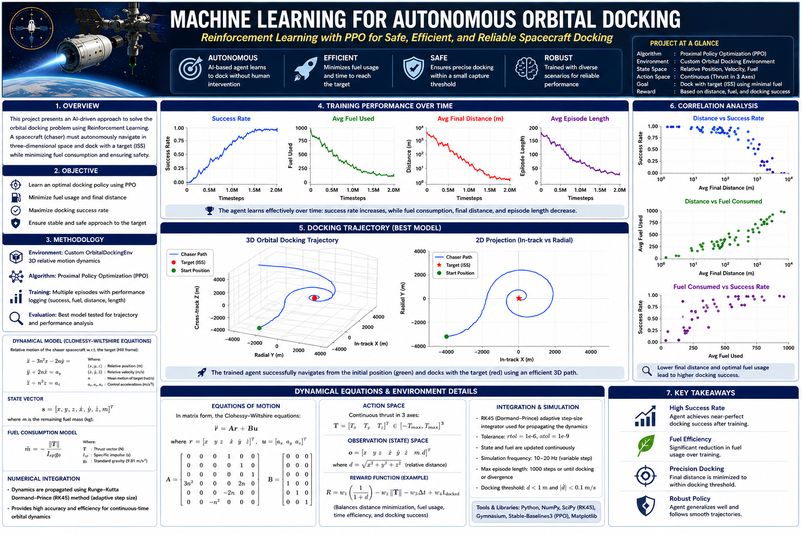
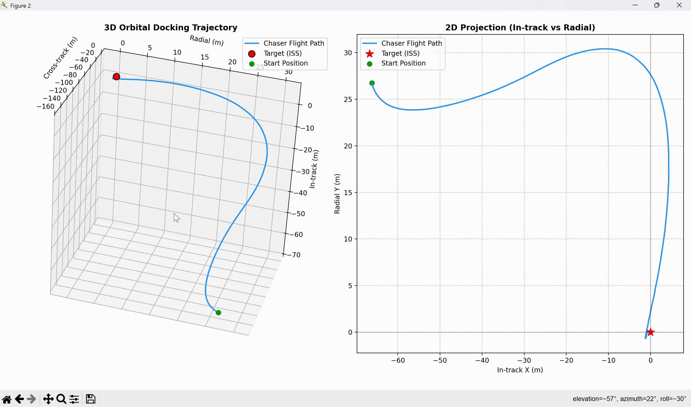

# AstroDockRL-Autonomous-Orbital-Docking-via-Reinforcement-Learning 
## Preview 


## Preview 



**AstroDockRL** is a high-fidelity reinforcement learning (RL) framework designed to train autonomous spacecraft agents for proximity operations and docking in Low Earth Orbit (LEO). Using the **Proximal Policy Optimization (PPO)** algorithm, the agent learns to navigate complex orbital mechanics while compensating for realistic environmental perturbations, actuator noise, and sensor uncertainty.

## ✨ Key Features

* **High-Fidelity Physics**: Relative motion modeled via Clohessy-Wiltshire (Hill's) equations.
* **Realistic Perturbations**:

  * $J_2$ oblateness differential acceleration
  * Aerodynamic drag (via **NRLMSISE-00** atmospheric model LUT + scale-height correction)
  * Solar radiation pressure (SRP) with eclipse transitions
* **Hardware Realism**: Thruster execution noise (dead-band, misalignment, magnitude errors) and GPS/IMU sensor noise.
* **Curriculum Learning**: Automated multi-stage training pipeline progressing from ideal kinematics to full stochastic realism.
* **3D Trajectory Visualization**: Matplotlib-based rendering of orbital planes and approach corridors.
* **Built on Industry Standards**: Powered by `Stable-Baselines3`, `Gymnasium`, and `PyTorch`.

---

## 📐 Mathematical Models

### 1. Relative Orbital Dynamics (Clohessy-Wiltshire Equations)

The chaser spacecraft's relative motion with respect to a target in a circular orbit is governed by the linearized Clohessy-Wiltshire (CW) equations in the Local Vertical Local Horizontal (LVLH) frame:

$$
\begin{align*}
\ddot{x} &= 3n^2x + 2n\dot{y} + u_x + a_{px} \
\ddot{y} &= -2n\dot{x} + u_y + a_{py} \
\ddot{z} &= -n^2z + u_z + a_{pz}
\end{align*}
$$

Where:

* $(x, y, z)$ are the relative positions (in-track, radial, cross-track).
* $n = \sqrt{\mu/a^3}$ is the mean motion of the target orbit.
* $(u_x, u_y, u_z)$ are the commanded thrust accelerations.
* $(a_{px}, a_{py}, a_{pz})$ are the differential perturbation accelerations.

### 2. Perturbation Models

The environment calculates differential accelerations ($\Delta a = a_{chaser} - a_{target}$) to simulate realistic orbital deviations.

#### 🌍 $J_2$ Oblateness

Differential acceleration caused by Earth's equatorial bulge. The linearized differential terms are applied based on the target's eccentricity and orbital radius.

#### 🌬️ Aerodynamic Drag (NRLMSISE-00)

Atmospheric drag is modeled using a pre-computed lookup table (LUT) generated from the **NRLMSISE-00** empirical atmospheric model, randomized with solar flux ($F10.7$) and geomagnetic ($Ap$) indices.

A scale-height ($H$) correction is applied for the chaser's radial offset ($y$):

$$
\rho_{chaser} = \rho_{target} \exp\left(-\frac{y}{H}\right)
$$

$$
a_{drag} = -\frac{1}{2} \rho v_{orb}^2 B
$$

*(Where $B$ is the ballistic coefficient.)*

#### ☀️ Solar Radiation Pressure (SRP)

Photon pressure acting on the spacecraft's solar panels. The differential SRP toggles off during orbital eclipse phases:

$$
\Delta a_{SRP} = P_{sr} \left( \left(\frac{C_r A}{m}\right)*{chaser} - \left(\frac{C_r A}{m}\right)*{target} \right) \hat{s}
$$

#### ⚙️ Actuator & Sensor Noise

* **Thruster Noise**: Includes a dead-band threshold, Gaussian magnitude errors ($\pm 5%$), and 3D rotational misalignment matrices.
* **Sensor Noise**: Gaussian noise added to observations ($\sigma_{pos} = 0.3,\text{m}$, $\sigma_{vel} = 0.003,\text{m/s}$) to simulate GPS/IMU uncertainty.

---

## 🧠 Reinforcement Learning Formulation

The problem is framed as a Markov Decision Process (MDP) solved via **PPO**.

### 🔍 Observation Space (9D)

The agent receives normalized states combined with domain-specific features:

$$
O_t = \left[ \frac{x}{d_{norm}}, \frac{y}{d_{norm}}, \frac{z}{d_{norm}}, \frac{v_x}{v_{norm}}, \frac{v_y}{v_{norm}}, \frac{v_z}{v_{norm}}, \frac{d}{d_{norm}}, \frac{v}{v_{norm}}, \frac{t}{t_{max}} \right]
$$

### 🎮 Action Space (3D Continuous)

Continuous thrust commands mapped to $[-u_{max}, u_{max}]$ in the LVLH frame.

### 🎯 Reward Function

A dense reward function shapes the approach corridor while penalizing unsafe behaviors:

* **Distance Improvement**: $+5.0 \times \frac{\Delta d}{d_{norm}}$
* **Proximity Bonus**: Exponential bonus as the chaser nears the target.
* **Velocity Penalty**: Penalizes high speeds near the target to ensure soft docking.
* **Fuel Penalty**: $-w_f ||u||_2$ to encourage fuel-efficient trajectories.
* **Terminal States**: $+100$ for successful docking (within $0.5,\text{m}$ and $<0.05,\text{m/s}$), with heavy penalties for boundary violations or collisions.

---

## 📂 Project Structure

```text
├── docking_env.py       # Custom Gymnasium environment (CW dynamics & perturbations)
├── hyperparameters.py   # Configuration dictionaries (PPO, ENV, Curriculum schedules)
├── train_ppo.py         # Main training loop, vectorized environments, and callback metrics
├── testml.py            # Evaluation script, 3D/2D trajectory plotting, and analytics
└── README.md            # Project documentation
```
